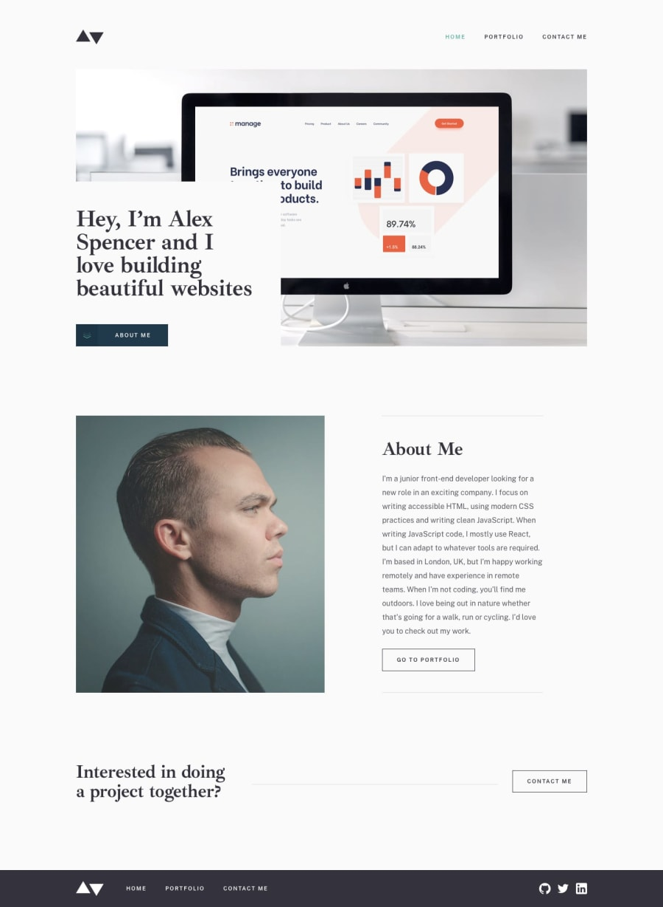
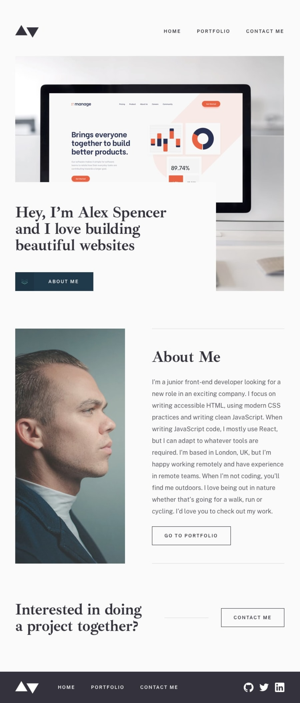
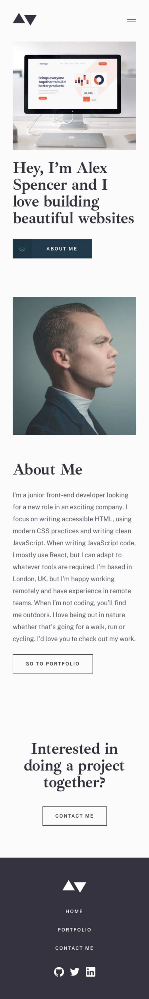
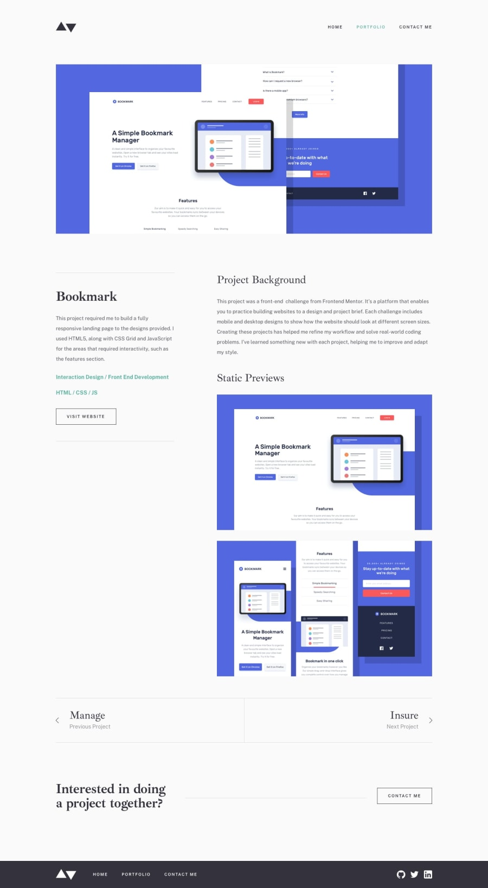

# Minimalist portfolio website

## Frontend Mentor

### live demo

[Minimalist portfolio website](https://marcinkisiel.github.io/frontend-mentor-minimalist-portfolio/)

### description

This is my solution for **_[Frontend Mentor](https://www.frontendmentor.io/challenges/minimalist-portfolio-website-LMy-ZRyiE)_** challenge, which was to build out this multi-page portfolio website. 
The design includes mobile, tablet & desktop views for a **Homepage**, **Portfolio**, **Projects** and **Contact** pages. A design system is also included to provide colors, fonts, etc.

### current status

unfinished

### implementation time

December 2021

### technologies

HTML, CSS

### tools used

Sass (SCSS), Gulp

### design

Frontend Mentor
 

### contact

**Marcin Kisiel**:
 
[kisiel.marcin@gmail.com](mailto:kisiel.marcin@gmail.com)
 
[LinkedIn](https://www.linkedin.com/in/marcin-kisiel/)
 
[GitHub](https://github.com/marcinkisiel)
 
